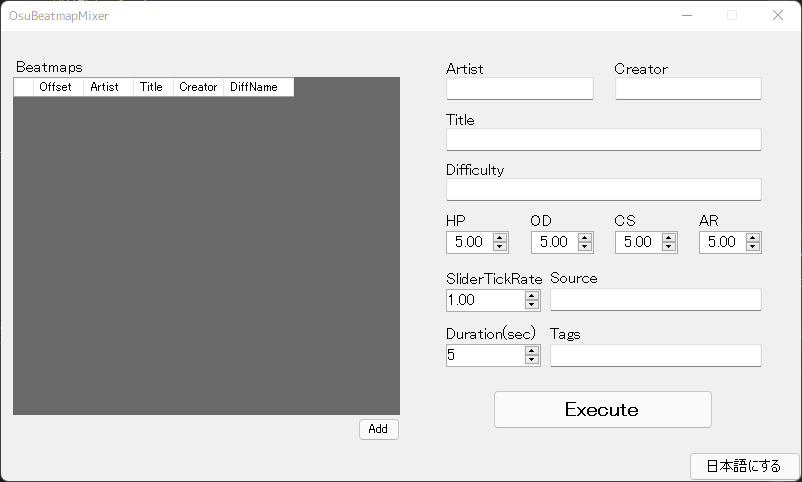

# OsuBeatmapMixer

Mix Beatmap and Beatmap and process them into one Beatmap. All mode supported!

[日本語はこちら！](./README_ja.md)

## Installation

.Net Framework 4.7.2(Windows 10 April 2018 Update
(version 1803) installed as standard) is required to run.

### Latest build: [Windows(x86)](https://github.com/Fairy-Phy/OsuBeatmapMixer/releases/latest/download/OsuBeatmapMixer.zip)

Unzip the zip file and open the exe file in it to run it.

## Usage

### Warning

* General(except some), Editor, Events and Colours are exported in their default state.

* Only Mania mode will be adjust for SV. However, please note that not all SV maps can be covered.

* SliderMultiplier must match in all modes except Mania mode.

### 1, Add Beatmap

Clicking the "Add" button at the bottom of the center of the screen will bring up a file selection screen, where you can select an osu file to add a beatmap. If you want to change the playback order, select the beatmap you want to change and press the up/down buttons displayed below.

### 2, Enter the Metadata and Difficulty

Enter the metadata on the right; the CS(Key) field is ignored in Mania mode. At least the artist name and title are required to run.

### 3, Press the Execute button

Press to check the map and export. After the check is completed, a screen for selecting the destination for the mp3 file will appear. **__Since the files to be saved are not osz but mp3 and osu files, please create a folder in the Songs folder and select it instead of putting the files in the Songs folder.__**

## License

This source code and software are licensed under the [Apache License 2.0](./LICENSE).
