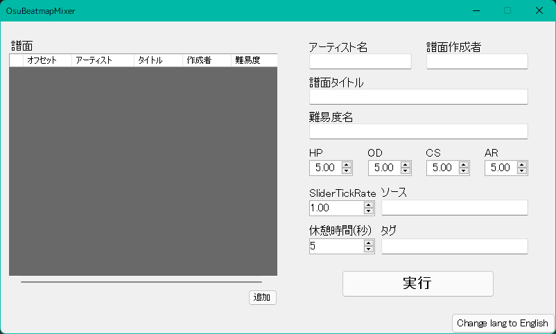

# OsuBeatmapMixer

譜面と譜面をくっつけて1つにします！全モード対応です。

## インストール方法

実行には .Net Framework 4.7.2(Windows 10 April 2018 Update
(version 1803)では標準インストール済み)が必要です。

### 最新バージョンのダウンロード: [Windows(x86)](https://github.com/Fairy-Phy/OsuBeatmapMixer/releases/latest/download/OsuBeatmapMixer.zip)

ダウンロードしたzipファイルを解凍し、中にあるexeファイルを開くと実行できます。

## 使い方

### 注意！

* General(一部除く), Editor, Events, Coloursは初期状態のものが使用されます。

* ManiaモードのみSVに対する調整が入ります。ただし、すべてのSV譜面を網羅できるわけではないのでご注意ください。

### 1, 譜面を追加する

真ん中の下辺りにある「追加」ボタンをおすことでファイル選択画面がでてくるので譜面ファイルを選択することで譜面を追加できます。再生順を変えたい場合は変えたい譜面を選択して下に表示される上下のボタンを押すと変更できます。

### 2, メタデータ・難易度を入力する

右のメタデータを入力します。Maniaモードの場合CS(Key)欄は無視されます。最低でもアーティスト名とタイトルがあれば実行できます。

### 3, 実行ボタンを押す

押すと、譜面のチェックが入ります。チェックが終わるとmp3ファイルの保存先を選択する画面がでてくるため選択します。**__保存するのはoszではなくmp3とosuファイルのためSongsフォルダーに入れるのではなくSongsフォルダー内にフォルダーを作り選択してください__**。

## ライセンス

このソースコードとソフトウェアのライセンスは[Apache License 2.0](./LICENSE)です。
